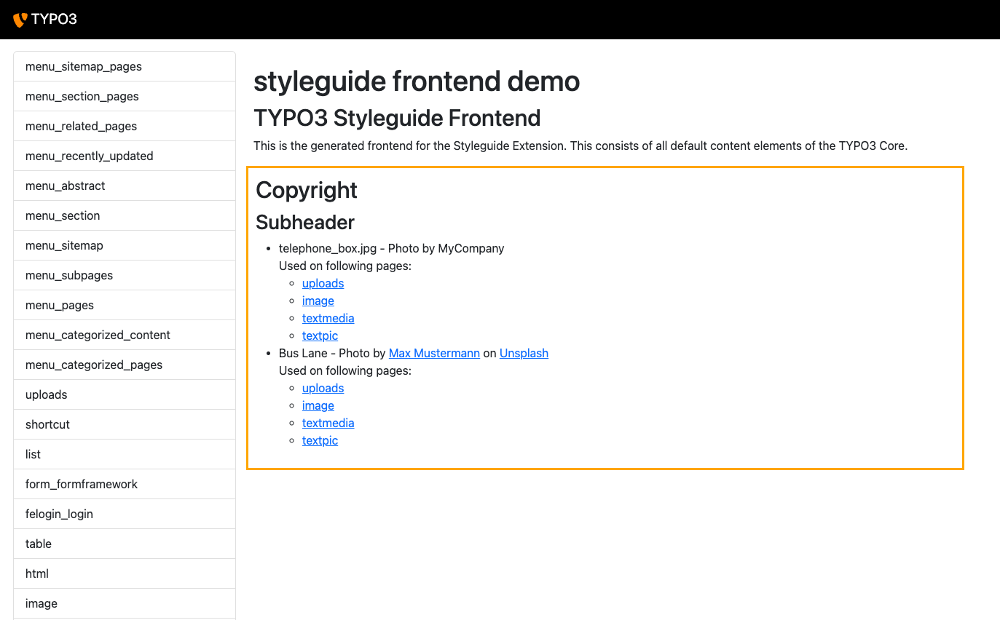
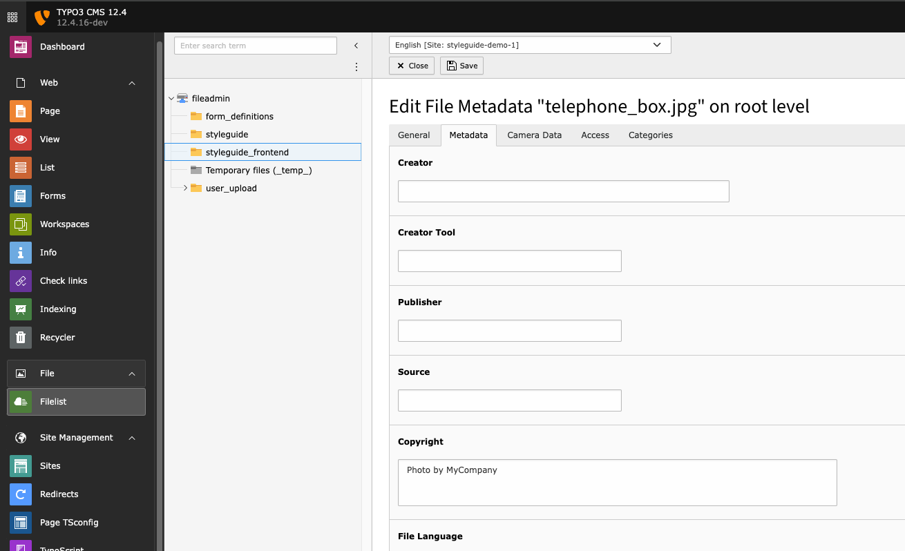

# Credits: Image Copyright Listing

The **Credits** extension for TYPO3 provides a content element that lists all
images used within the site, provided that copyright information has been
properly maintained in the metadata. For each image, the extension also lists
the pages on which the image is used.

## Features

- Displays a list of all images with copyright information.
- Shows the pages where each image is used.
- Easy integration as a TYPO3 content element.
- Multisite support: only images used in the same site are displayed.



## Requirements

- TYPO3 v12.4 or higher
- PHP 8.1 or higher
- TYPO3 core extension: filemetadata  (`typo3/cms-filemetadata`)

## Installation

Install via Composer: `composer require schliesser/credits`

Or via Extension Manager from TER.

## Configuration

No configuration needed. Not even a TypoScript to include!

## Usage

### Add copyrights to file metadata

To ensure the extension works correctly, make sure to maintain the copyright
information in the metadata of each image:

1. Navigate to the Filelist module in the TYPO3 backend.
2. Select an image file and open the file properties.
3. Selecte the metadata tab.
4. Enter the copyright information in the copyright field.
5. Save the changes.

> **_NOTE:_** Only images with copyright are listet!




### Add the content element

In the TYPO3 backend, go the page where you want to display the image copyright
list. Add a new content element and select the "Image Copyright Listing" element
from the wizard. You can add a Headline. No further configuration is needed.

## Customization

To customize the HTML output, you can override the Fluid templates used by this
extension. Copy the template from EXT:credits/Resources/Private/Templates to
your site package extension and adjust them as needed.

Register your custom template path in TypoScript:
```typo3_typoscript
tt_content.credits_images.20.view.templateRootPaths.100 = EXT:site_package/Resources/Private/Templates/Credits
```

## Contribution

We welcome contributions to improve this extension. Please submit your issues
and pull requests on [GitHub](https://github.com/schliesser/credits).

### Development setup

- Clone project and `cd` into the extension folder
- Install dependencies for tests: `composer install`
- Run tests with: `composer run test`
